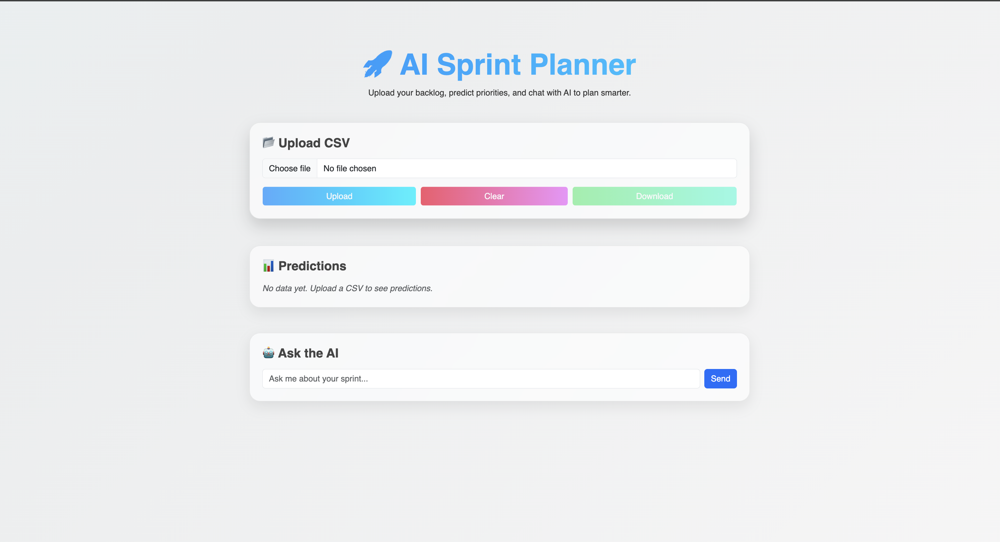

# 🚀 AI Sprint Planner

AI Sprint Planner helps you **plan smarter sprints** by predicting **priority, story points, and effort estimates** from your Jira backlog.  
Upload a CSV with your user stories, and chat with AI to refine your sprint plan.

---

## ✨ Features
- 📂 Upload **Jira backlog CSVs** (export from Jira)  
- 🤖 AI-powered predictions for:
  - Priority (Critical / High / Medium / Low)
  - Story Points (Fibonacci scale)
  - Estimate Hours
- 📊 Interactive table with color-coded priorities
- 💬 Chatbox to ask AI sprint-related questions
- 🎨 Modern, responsive UI with gradient backgrounds

---

## 📦 Installation

Clone the repo and install dependencies:

```bash
git clone https://github.com/paludal007/ai-sprint-planner-chatbox.git
cd ai-sprint-planner-chatbox
npm install
```

Run the development server:

```bash
npm run dev
```

The app will be available at 👉 [http://localhost:3000](http://localhost:3000)

---

## 📂 Project Structure

```
.
├── public/          # Frontend (HTML, CSS, JS)
├── server.js        # Node.js backend server
├── model.js         # Local ML model (priority + estimates)
├── jira/            # Folder for Jira backlog CSV files
│   ├── sample-backlog.csv
│   └── ...
└── README.md
```

- Place your **Jira export CSVs** in the `jira/` folder.  
- CSV must include at least `Summary` and/or `Description` columns.  

---

## 📊 Example CSV Input

| Summary                  | Description                          |
|---------------------------|--------------------------------------|
| Login not working         | Users cannot log in after update     |
| UI button misaligned      | Minor CSS fix needed                 |
| Payment gateway failing   | Checkout blocked for all customers   |

---

## 📊 Example AI Output

| Priority  | StoryPoints | EstimateHours | Confidence | Rationale |
|-----------|-------------|---------------|------------|-----------|
| Critical  | 8           | 32h           | 0.92       | Payment failure → revenue impact |
| Medium    | 3           | 8h            | 0.65       | UI bug, cosmetic only            |

---

## 💬 Chat with AI
You can ask the AI things like:
- *"Which tasks should we do first?"*
- *"What’s the total estimated effort?"*
- *"How many high-priority issues are in the sprint?"*

---

## 📸 Screenshots

### Dashboard



---

## 📜 License
MIT License © 2025 Udal Pal
